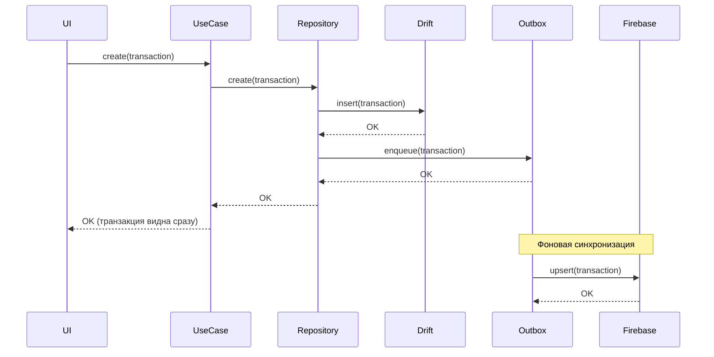

# Архитектура приложения Kopim

## Обзор

Приложение Kopim построено на принципах **Clean Architecture** и **Domain-Driven Design (DDD)** с акцентом на **feature-first модульность** и **offline-first подход**.

## Ключевые принципы

### 1. Feature-First модульность

Код организован по фичам (функциональным возможностям), а не по техническим слоям:

```
lib/
├── core/                    # Общие компоненты
│   ├── data/               # Базовая БД, утилиты
│   ├── services/           # Общие сервисы
│   ├── widgets/            # Переиспользуемые UI-компоненты
│   └── theme/              # Темы и стили
│
└── features/               # Все фичи приложения
    ├── accounts/           # Управление счетами
    ├── transactions/       # Транзакции
    ├── categories/         # Категории
    ├── budgets/            # Бюджеты
    ├── analytics/          # Аналитика
    ├── savings/            # Цели накоплений
    ├── upcoming_payments/  # Повторяющиеся платежи и напоминания
    ├── profile/            # Профиль пользователя
    ├── settings/           # Настройки
    ├── home/               # Главный экран
    ├── app_shell/          # Навигация и структура
    └── ai/                 # AI-ассистент
```

### 2. Clean Architecture: Трёхслойная структура

Каждая фича разделена на три независимых слоя:

```
feature/
├── presentation/           # UI Layer (Widgets, Controllers)
│   ├── screens/           # Полноэкранные страницы
│   ├── widgets/           # Локальные компоненты фичи
│   ├── controllers/       # State management (Riverpod)
│   └── providers/         # Riverpod providers
│
├── domain/                # Business Logic Layer
│   ├── entities/          # Бизнес-модели (Freezed, immutable)
│   ├── repositories/      # Интерфейсы репозиториев
│   ├── use_cases/         # Бизнес-логика (use cases)
│   └── models/            # Value objects, enums
│
└── data/                  # Data Layer (Infrastructure)
    ├── repositories/      # Реализации репозиториев
    ├── sources/
    │   ├── local/        # Drift DAO (локальная БД)
    │   └── remote/       # Firebase data sources
    └── models/           # DTO, mappers
```

## Слои архитектуры

### Presentation Layer (UI)

**Ответственность:**
- Отображение данных пользователю
- Обработка пользовательского ввода
- Навигация между экранами

**Технологии:**
- **Flutter widgets** — декларативный UI
- **Riverpod** — state management
- **go_router** — навигация

**Правила:**
- ✅ Использовать только entities из domain
- ✅ Вызывать use cases через Riverpod providers
- ❌ Нельзя напрямую обращаться к data layer
- ❌ Нельзя содержать бизнес-логику

**Пример:**
```dart
// presentation/controllers/transactions_controller.dart
@riverpod
class TransactionsController extends _$TransactionsController {
  @override
  Future<List<TransactionEntity>> build() async {
    final useCase = ref.read(listTransactionsUseCaseProvider);
    return useCase.execute();
  }
  
  Future<void> createTransaction(TransactionEntity transaction) async {
    final useCase = ref.read(createTransactionUseCaseProvider);
    await useCase.execute(transaction);
    ref.invalidateSelf();
  }
}
```

### Domain Layer (Бизнес-логика)

**Ответственность:**
- Определение бизнес-правил
- Хранение entities (бизнес-моделей)
- Определение интерфейсов репозиториев

**Технологии:**
- **Freezed** — immutable entities
- **Dart** — чистый Dart без зависимостей от Flutter/Firebase

**Правила:**
- ✅ Полностью независимый от UI и инфраструктуры
- ✅ Все entities immutable
- ✅ Только интерфейсы репозиториев (contracts)
- ❌ Нельзя импортировать Flutter, Firebase, Drift

**Пример Entity:**
```dart
// domain/entities/transaction.dart
@freezed
class TransactionEntity with _$TransactionEntity {
  const factory TransactionEntity({
    required String id,
    required String accountId,
    String? categoryId,
    required double amount,
    required DateTime date,
    String? note,
    required TransactionType type,
    required DateTime createdAt,
    required DateTime updatedAt,
    @Default(false) bool isDeleted,
  }) = _TransactionEntity;
  
  // Бизнес-логика в виде методов
  const TransactionEntity._();
  
  bool get isIncome => type == TransactionType.income;
  bool get isExpense => type == TransactionType.expense;
}
```

**Пример Use Case:**
```dart
// domain/use_cases/create_transaction_uc.dart
class CreateTransactionUseCase {
  CreateTransactionUseCase(this._repository);
  
  final TransactionRepository _repository;
  
  Future<void> execute(TransactionEntity transaction) async {
    // Валидация бизнес-правил
    if (transaction.amount <= 0) {
      throw ValidationException('Amount must be positive');
    }
    
    // Делегирование репозиторию
    await _repository.create(transaction);
  }
}
```

**Пример Repository Interface:**
```dart
// domain/repositories/transaction_repository.dart
abstract class TransactionRepository {
  Future<List<TransactionEntity>> getAll();
  Future<TransactionEntity?> getById(String id);
  Future<void> create(TransactionEntity transaction);
  Future<void> update(TransactionEntity transaction);
  Future<void> delete(String id);
}
```

### Data Layer (Инфраструктура)

**Ответственность:**
- Реализация репозиториев
- Доступ к локальной БД (Drift)
- Взаимодействие с Firebase
- Маппинг данных (DTO ↔ Entity)

**Технологии:**
- **Drift** — локальная SQL БД
- **Firebase Firestore** — облачное хранилище
- **connectivity_plus** — определение сети

**Правила:**
- ✅ Реализует интерфейсы из domain
- ✅ Использует Drift для offline-first
- ✅ Синхронизация через Outbox pattern
- ❌ Нельзя содержать бизнес-логику

**Пример Repository Implementation:**
```dart
// data/repositories/transaction_repository_impl.dart
class TransactionRepositoryImpl implements TransactionRepository {
  TransactionRepositoryImpl({
    required this.localDao,
    required this.outboxDao,
  });
  
  final TransactionDao localDao;
  final OutboxDao outboxDao;
  
  @override
  Future<void> create(TransactionEntity transaction) async {
    // 1. Записать в Drift (источник истины)
    await localDao.insert(transaction);
    
    // 2. Добавить в Outbox для синхронизации
    await outboxDao.enqueue(
      entityType: 'transaction',
      entityId: transaction.id,
      operation: OutboxOperation.upsert,
      payload: transaction.toJson(),
    );
  }
  
  @override
  Future<List<TransactionEntity>> getAll() {
    return localDao.getAllTransactions();
  }
}
```

## Dependency Injection (Riverpod)

Все зависимости управляются через **Riverpod providers**.

### Порядок инъекции зависимостей

```
DAOs/DataSources → Repositories → Use Cases → Controllers → UI
```

**Пример:**
```dart
// core/di/injectors.dart

// 1. DAO providers
@riverpod
TransactionDao transactionDao(TransactionDaoRef ref) {
  final database = ref.watch(appDatabaseProvider);
  return TransactionDao(database);
}

// 2. Repository providers
@riverpod
TransactionRepository transactionRepository(TransactionRepositoryRef ref) {
  return TransactionRepositoryImpl(
    localDao: ref.watch(transactionDaoProvider),
    outboxDao: ref.watch(outboxDaoProvider),
  );
}

// 3. Use Case providers
@riverpod
CreateTransactionUseCase createTransactionUseCase(
  CreateTransactionUseCaseRef ref,
) {
  return CreateTransactionUseCase(
    ref.watch(transactionRepositoryProvider),
  );
}

// 4. Controller (в presentation/)
@riverpod
class TransactionsController extends _$TransactionsController {
  @override
  Future<List<TransactionEntity>> build() {
    final repo = ref.watch(transactionRepositoryProvider);
    return repo.getAll();
  }
}
```

## Offline-First подход

### Принцип работы

1. **Локальная БД — источник истины**: UI всегда читает из Drift
2. **Запись в Drift первой**: изменения сразу отражаются в UI
3. **Outbox для синхронизации**: изменения попадают в очередь
4. **Фоновая синхронизация**: SyncService отправляет в Firebase при наличии сети

### Поток данных (Создание транзакции)



**Преимущества:**
- ⚡ Мгновенная реакция UI
- 🔌 Работа полностью offline
- 🔄 Надёжная синхронизация при восстановлении сети
- 📱 Одинаковый опыт на всех устройствах

## State Management (Riverpod)

### Типы providers

1. **Provider** — immutable значения (DI)
2. **FutureProvider** — асинхронная загрузка данных
3. **StreamProvider** — реактивные потоки данных
4. **NotifierProvider** — изменяемое состояние

### Оптимизация производительности

**❌ Неоптимально:**
```dart
// Пересоздаёт весь список при изменении любого счёта
final accounts = ref.watch(accountsProvider);
```

**✅ Оптимально:**
```dart
// Обновляется только при изменении баланса конкретного счёта
final balance = ref.watch(
  accountsProvider.select((accounts) => 
    accounts.firstWhere((a) => a.id == accountId).balance
  ),
);
```

## Тестирование

### Пирамида тестов

```
           /\
          /  \  E2E (интеграционные)
         /____\
        /      \  Widget tests
       /________\
      /          \  Unit tests (основа)
     /__________\
```

### Unit Tests

**Цель:** Тестировать entities, use cases, mappers

```dart
// test/domain/use_cases/create_transaction_uc_test.dart
void main() {
  late MockTransactionRepository mockRepository;
  late CreateTransactionUseCase useCase;
  
  setUp(() {
    mockRepository = MockTransactionRepository();
    useCase = CreateTransactionUseCase(mockRepository);
  });
  
  test('should throw when amount is negative', () {
    final transaction = TransactionEntity(
      id: '1',
      amount: -100, // Невалидная сумма
      // ...
    );
    
    expect(
      () => useCase.execute(transaction),
      throwsA(isA<ValidationException>()),
    );
  });
}
```

### Widget Tests

**Цель:** Тестировать UI-компоненты изолированно

```dart
testWidgets('should display transaction amount', (tester) async {
  final transaction = TransactionEntity(
    id: '1',
    amount: 1500.50,
    // ...
  );
  
  await tester.pumpWidget(
    MaterialApp(
      home: TransactionTile(transaction: transaction),
    ),
  );
  
  expect(find.text('1 500,50 ₽'), findsOneWidget);
});
```

### Integration Tests

**Цель:** Тестировать взаимодействие слоёв (DB + sync + UI)

```dart
testWidgets('transaction insert updates account balance', (tester) async {
  // 1. Создать транзакцию
  await tester.tap(find.byIcon(Icons.add));
  await tester.enterText(find.byKey(Key('amount')), '1000');
  await tester.tap(find.text('Сохранить'));
  
  // 2. Проверить обновление баланса счёта
  expect(find.text('Баланс: 11 000 ₽'), findsOneWidget);
  
  // 3. Проверить появление в аналитике
  await tester.tap(find.byIcon(Icons.analytics));
  expect(find.text('Расходы: 1 000 ₽'), findsOneWidget);
});
```

## Производительность

### Правила для списков

1. **Использовать `itemExtent`** для фиксированной высоты:
```dart
ListView.builder(
  itemExtent: 72, // Фиксированная высота элемента
  itemBuilder: (context, index) => TransactionTile(...),
)
```

2. **Кешировать форматтеры**:
```dart
class TransactionTile extends ConsumerWidget {
  static final _dateFormat = DateFormat.yMMMd('ru');
  static final _amountFormat = NumberFormat.currency(symbol: '₽');
  
  // Используем кешированные форматтеры
}
```

3. **Использовать `.select()` для точечных обновлений**:
```dart
// Только нужное поле
final balance = ref.watch(
  accountProvider(id).select((account) => account.balance)
);
```

## Производство и развёртывание

### Сборка

```bash
# Анализ кода
flutter analyze

# Генерация кода (Freezed, Riverpod)
dart run build_runner build --delete-conflicting-outputs

# Тесты
flutter test

# Билд для продакшена
flutter build apk --release       # Android
flutter build ios --release       # iOS
flutter build web --release       # Web
```

### CI/CD

Автоматические проверки при каждом commit:
1. Форматирование (`dart format --set-exit-if-changed`)
2. Анализ (`flutter analyze`)
3. Тесты (`flutter test`)
4. Сборка (`flutter build`)

## Связанные документы

- [Синхронизация с Firebase](firebase_sync.md) — подробности offline-first и Outbox pattern
- [Компоненты](../components/README.md) — документация UI-виджетов

---

**Примечание**: Документация актуальна на момент создания. При изменении архитектурных решений обновите этот файл.
