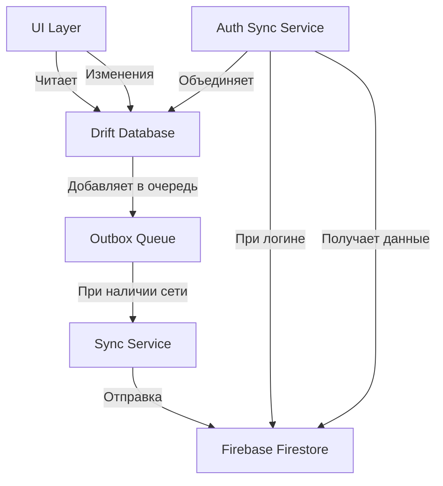
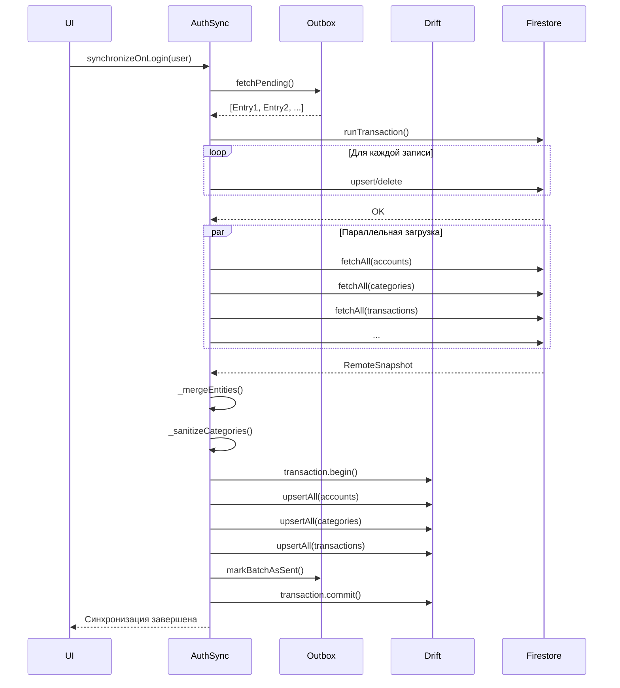

# Синхронизация с Firebase

## Назначение

Описание механизма синхронизации данных между локальной базой данных (Drift) и облач Firebase Firestore в приложении Kopim.

## Архитектура синхронизации

Приложение использует **offline-first** подход:

1. **Локальная БД (Drift)** — единственный источник истины для UI
2. **Outbox Pattern** — очередь изменений для отправки в Firebase
3. **Двусторонняя синхронизация** — слияние локальных и удалённых данных



## Компоненты системы

### 1. Outbox Pattern (Очередь исходящих изменений)

**Файл:** [`outbox_dao.dart`](file:///home/artem/StudioProjects/kopim/lib/core/data/outbox/outbox_dao.dart)

Паттерн Outbox используется для надёжной доставки изменений в Firebase:

- **Запись в Outbox**: каждое изменение (создание, обновление, удаление) записывается в локальную таблицу `outbox_entries`
- **Статусы записей**:
  - `pending` — ожидает отправки
  - `sending` — в процессе отправки
  - `sent` — успешно отправлено
  - `failed` — ошибка при отправке

**Типы операций:**
```dart
enum OutboxOperation {
  upsert,   // Создание или обновление
  delete,   // Удаление (soft delete)
}
```

**Поддерживаемые сущности:**
- Счета (`account`)
- Категории (`category`)
- Транзакции (`transaction`)
- Бюджеты (`budget`, `budget_instance`)
- Цели накоплений (`saving_goal`)
- Регулярные транзакции (`recurring_rule`)
- Профиль пользователя (`profile`)

### 2. SyncService (Фоновая синхронизация)

**Файл:** [`sync_service.dart`](file:///home/artem/StudioProjects/kopim/lib/core/services/sync_service.dart)

Отвечает за автоматическую отправку изменений из Outbox в Firestore.

#### Принцип работы

1. **Мониторинг подключения**: отслеживает состояние сети через `connectivity_plus`
2. **Наблюдение за Outbox**: подписывается на изменения в таблице `outbox_entries`
3. **Автоматическая синхронизация**: при появлении записей в Outbox и наличии интернета — отправляет их пакетами

#### Алгоритм синхронизации

```dart
Future<void> syncPending() async {
  if (_isSyncing || !_isOnline) return;
  
  // 1. Получить до 100 записей из Outbox
  final entries = await _outboxDao.fetchPending(limit: 100);
  
  // 2. Для каждой записи:
  for (final entry in entries) {
    // - Подготовить к отправке (статус → "sending")
    final prepared = await _outboxDao.prepareForSend(entry);
    
    try {
      // - Десериализовать payload
      // - Вызвать соответствующий RemoteDataSource
      // - Отметить как успешно отправленную
      await _syncEntry(userId, prepared);
      await _outboxDao.markAsSent(prepared.id);
    } catch (error) {
      // - При ошибке — отметить как failed
      await _outboxDao.markAsFailed(prepared.id, error.toString());
    }
  }
  
  // 3. Очистить отправленные записи
  await _outboxDao.pruneSent();
}
```

#### Обработка ошибок

- **Сетевые ошибки**: запись остаётся в Outbox со статусом `failed`, повторная попытка при следующей синхронизации
- **Критические ошибки**: логируются в Firebase Crashlytics
- **Повторные попытки**: автоматические при восстановлении подключения

### 3. AuthSyncService (Синхронизация при логине)

**Файл:** [`auth_sync_service.dart`](file:///home/artem/StudioProjects/kopim/lib/core/services/auth_sync_service.dart)

Выполняет полную двустороннюю синхронизацию при входе пользователя в систему.

#### Этапы синхронизации при логине

```
1. Подготовка локальных изменений
   └─ Получить все pending записи из Outbox (до 500)
   └─ Перевести в статус "sending"

2. Отправка в Firestore
   └─ Применить все изменения одной транзакцией Firestore
   └─ Обеспечивает атомарность: либо всё, либо ничего

3. Получение удалённых данных
   └─ Параллельно загрузить все коллекции из Firestore
   └─ Аккаунты, категории, транзакции, бюджеты и т.д.

4. Слияние данных (Three-Way Merge)
   └─ Для каждой сущности:
      ├─ Сравнить local vs remote по полю updatedAt
      ├─ Выбрать более свежую версию
      └─ Объединить в финальный набор

5. Нормализация и дедупликация
   └─ Убрать дубликаты категорий (по имени)
   └─ Переназначить ссылки на канонические ID
   └─ Топологическая сортировка (родители перед детьми)

6. Сохранение в Drift
   └─ Атомарно заменить все данные в одной транзакции
   └─ Очистить Outbox от отправленных записей
```

#### Алгоритм слияния (Last-Write-Wins)

```dart
List<T> _mergeEntities<T>({
  required List<T> local,
  required List<T> remote,
  required String Function(T) getId,
  required DateTime Function(T) getUpdatedAt,
}) {
  final Map<String, T> merged = {};
  
  // 1. Добавить все локальные
  for (final item in local) {
    merged[getId(item)] = item;
  }
  
  // 2. Для каждого удалённого:
  for (final remoteItem in remote) {
    final key = getId(remoteItem);
    final existing = merged[key];
    
    // Если локальной нет — добавить
    if (existing == null) {
      merged[key] = remoteItem;
      continue;
    }
    
    // Если удалённая новее — заменить
    if (getUpdatedAt(existing).isBefore(getUpdatedAt(remoteItem))) {
      merged[key] = remoteItem;
    }
  }
  
  return merged.values.toList();
}
```

#### Дедупликация категорий

Категории с одинаковыми именами (case-insensitive) объединяются:

1. **Группировка** по нормализованному имени
2. **Выбор канонической**: удалённая (не удалённая) с самым свежим `updatedAt`
3. **Маппинг ID**: все старые ID → канонический ID
4. **Обновление ссылок**: в транзакциях, бюджетах, регулярных правилах

Пример:
```
Локально: Category(id: "local-1", name: "Еда", updatedAt: 15:00)
Удалённо: Category(id: "remote-2", name: "еда", updatedAt: 16:00)

Результат:
→ Канонический: Category(id: "remote-2", name: "еда")
→ Маппинг: local-1 → remote-2
→ Все транзакции с categoryId="local-1" переназначаются на "remote-2"
```

## Конфликты и их разрешение

### Стратегия: Last-Write-Wins (LWW)

Приложение использует простую стратегию разрешения конфликтов по времени обновления:

- **Сравнение по `updatedAt`**: побеждает версия с более поздним временем
- **Без ручного разрешения**: конфликты разрешаются автоматически
- **Потеря данных**: возможна, если два устройства редактируют одну сущность offline

### Защита от потери данных

1. **Soft Delete**: удалённые сущности помечаются флагом `isDeleted` вместо физического удаления
2. **Audit Trail**: каждая сущность имеет `createdAt` и `updatedAt`
3. **Outbox Retry**: при ошибке отправки данные остаются в очереди

## Поток данных

### Создание новой транзакции

```
[UI] Нажатие "Сохранить"
  ↓
[Repository] transaction.save()
  ↓
[TransactionDao] insert() в Drift
  ↓
[OutboxDao] insertPendingOperation(entity: transaction, operation: upsert)
  ↓
[SyncService] Обнаруживает новую запись в Outbox (через watch stream)
  ↓
[SyncService] syncPending() — проверяет сеть
  ↓
[TransactionRemoteDataSource] upsert() в Firestore
  ↓
[OutboxDao] markAsSent()
```

### Вход в приложение (после offline работы)

```
[AuthSyncService] synchronizeOnLogin()
  ↓
1. Подготовка Outbox: pending → sending
  ↓
2. Firestore Transaction: отправка всех локальных изменений
  ↓
3. Параллельная загрузка всех коллекций из Firestore
  ↓
4. Слияние local + remote (Last-Write-Wins)
  ↓
5. Дедупликация категорий
  ↓
6. Drift Transaction: замена всех данных
  ↓
7. Очистка Outbox
  ↓
[UI] Обновляется через Riverpod providers
```

## Особенности реализации

### Атомарность операций

- **Firestore Transaction**: все изменения от Outbox применяются атомарно
- **Drift Transaction**: слияние данных происходит в одной транзакции БД
- **Rollback при ошибке**: если синхронизация падает, Outbox возвращается в состояние `pending`

### Производительность

- **Пакетная обработка**: до 100 записей за раз в `SyncService`, до 500 при логине
- **Параллельная загрузка**: все коллекции из Firestore загружаются одновременно через `Future.wait`
- **Оффлайн-первичность**: UI никогда не блокируется ожиданием сети

### Логирование и аналитика

- **Firebase Analytics**: события `auth_sync_start`, `auth_sync_success`
- **Firebase Crashlytics**: ошибки синхронизации
- **LoggerService**: детальные логи для отладки

## Ограничения и известные проблемы

1. **Конфликты данных**: LWW может привести к потере изменений при одновременном редактировании
2. **Лимит Outbox**: при очень долгом offline может накопиться большая очередь
3. **Сетевые таймауты**: крупные синхронизации могут прерваться по таймауту
4. **Удаление категорий**: если категория удалена, связанные транзакции теряют `categoryId`

## Тестирование

### Unit-тесты

- Тестирование логики слияния `_mergeEntities`
- Тестирование дедупликации категорий
- Тестирование нормализации ссылок

### Integration-тесты

- Полный цикл: insert → outbox → sync → firestore
- Сценарий offline → online → sync
- Сценарий конфликта: два устройства редактируют одну сущность

## Связанные файлы

- Основной сервис: [`sync_service.dart`](file:///home/artem/StudioProjects/kopim/lib/core/services/sync_service.dart)
- Синхронизация при логине: [`auth_sync_service.dart`](file:///home/artem/StudioProjects/kopim/lib/core/services/auth_sync_service.dart)
- Outbox DAO: [`outbox_dao.dart`](file:///home/artem/StudioProjects/kopim/lib/core/data/outbox/outbox_dao.dart)
- Remote Data Sources: `lib/features/*/data/sources/remote/*_remote_data_source.dart`

## Диаграмма последовательности (при логине)



---

**Примечание**: Документация актуальна на момент создания. При изменении логики синхронизации необходимо обновить этот файл.
