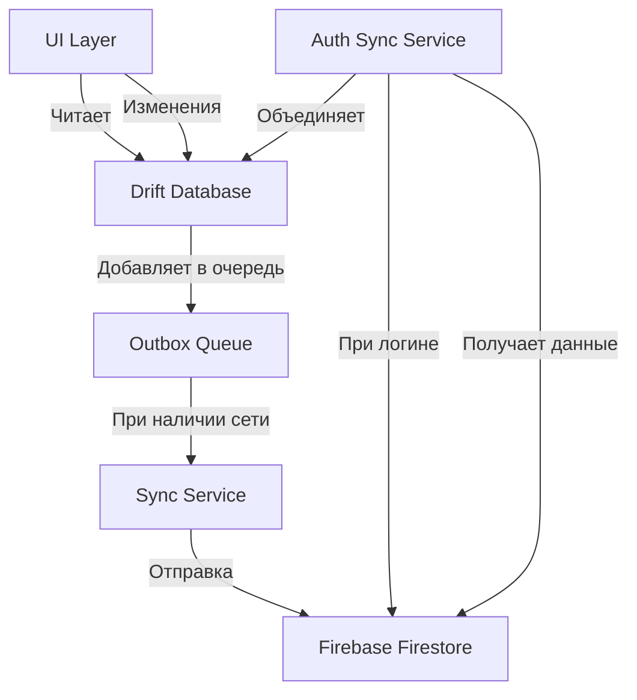
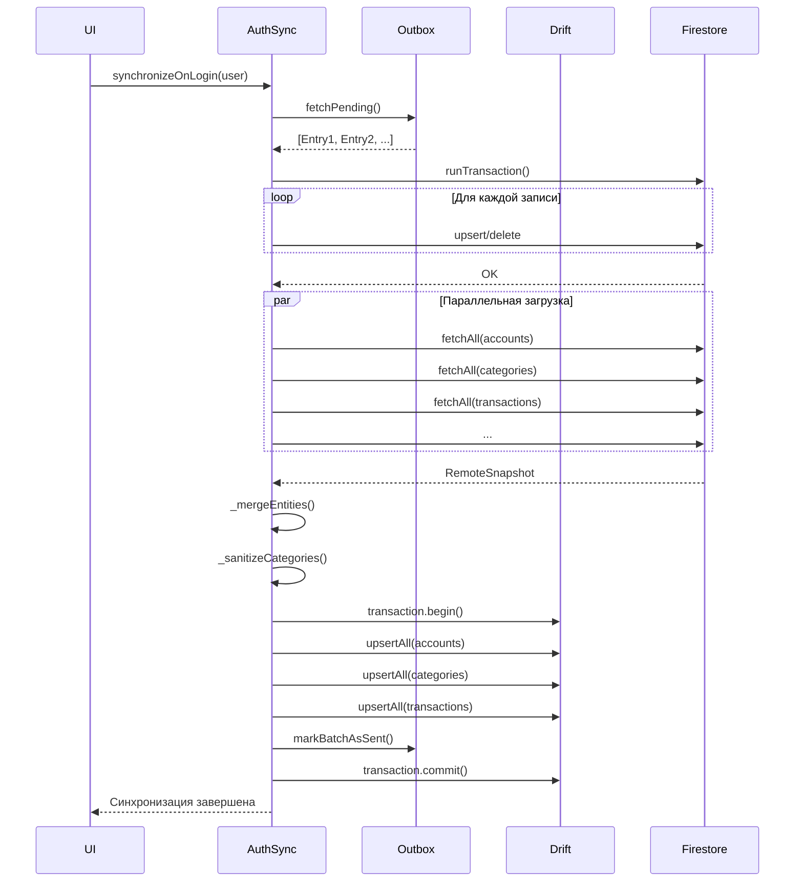

# Синхронизация с Firebase

## Назначение

Описание механизма синхронизации данных между локальной базой данных (Drift) и облач Firebase Firestore в приложении Kopim.

## Архитектура синхронизации

Приложение использует **offline-first** подход:

1. **Локальная БД (Drift)** — единственный источник истины для UI
2. **Outbox Pattern** — очередь изменений для отправки в Firebase
3. **Двусторонняя синхронизация** — слияние локальных и удалённых данных


```mermaid
graph TB
    UI[UI Layer] -->|Читает| Drift[Drift Database]
    UI -->|Изменения| Drift
    Drift -->|Добавляет в очередь| Outbox[Outbox Queue]
    Outbox -->|При наличии сети| SyncService[Sync Service]
    SyncService -->|Отправка| Firestore[Firebase Firestore]
    AuthSync[Auth Sync Service] -->|При логине| Firestore
    AuthSync -->|Получает данные| Firestore
    AuthSync -->|Объединяет| Drift
```

## Компоненты системы

### 1. Outbox Pattern (Очередь исходящих изменений)

**Файл:** `lib/core/data/outbox/outbox_dao.dart`

Паттерн Outbox используется для надёжной доставки изменений в Firebase:

- **Запись в Outbox**: каждое изменение (создание, обновление, удаление) записывается в локальную таблицу `outbox_entries`
- **Статусы записей**:
  - `pending` — ожидает отправки
  - `sending` — в процессе отправки
  - `sent` — успешно отправлено
  - `failed` — ошибка при отправке

**Типы операций:**
```dart
enum OutboxOperation {
  upsert,   // Создание или обновление
  delete,   // Удаление (soft delete)
}
```

**Поддерживаемые сущности:**
- Счета (`account`)
- Категории (`category`)
- Теги и связи тегов (`tag`, `transaction_tag`)
- Транзакции (`transaction`)
- Кредиты и долговые сущности (`credit`, `credit_card`, `debt`)
- Credit payment artifacts (`credit_payment_group`, `credit_payment_schedule`)
- Бюджеты (`budget`, `budget_instance`)
- Цели накоплений (`saving_goal`)
- Повторяющиеся платежи (`upcoming_payment`)
- Напоминания (`payment_reminder`)
- Профиль пользователя (`profile`)

**Надёжность очереди:**
- `pending` и `failed` записи автоматически подхватываются повторно.
- `sending` записи старше recovery window переводятся обратно в `pending` перед login sync и фоновым sync, чтобы очередь не зависала после краша.
- `fetchPending()/watchPending()` упорядочивают сущности по `dependencyOrder` из `SyncContract`, чтобы сначала уходили базовые ссылки (`accounts`, `categories`, `saving_goals`), а затем зависимые записи (`transactions`, `links`, `schedules`).
- Повторные unsent операции одного типа для той же сущности схлопываются консервативно: `upsert+upsert` и `delete+delete` обновляют существующую запись, но `upsert+delete` не превращается автоматически в no-op без признака, что сущность уже была известна remote.
- `sent` записи не удаляются мгновенно: `pruneSent()` оставляет их до retain window для диагностики и безопасного recovery.

**Импорт бэкапа:**
- Импорт CSV/JSON не ограничивается локальной записью в Drift.
- Каноничный миграционный формат — `JSON`. CSV остается форматом совместимости, но не считается основным контрактом переноса между backend/runtime поколениями.
- Backup покрывает пользовательский snapshot и derived export-sections: `accounts`, `categories`, `transactions`, `saving_goals`, `credits`, `credit_cards`, `debts`, `tags`, `transaction_tags`, `budgets`, `budget_instances`, `upcoming_payments`, `payment_reminders`, `profile`, `progress`.
- Список удалённых коллекций и локально-исключённых артефактов теперь централизован в `SyncContract`, чтобы login sync, cleanup и backup не расходились по составу данных.
- Avatar binary не экспортируется. `photoUrl` профиля может переноситься как строковое поле, но это не гарантирует доступность старого Firebase Storage asset после миграции backend.
- `progress` в backup не является каноничным пользовательским state: это derived snapshot от локальных транзакций на момент экспорта, используемый для переносимости и integrity-проверки.
- Импорт выполняется как `merge-only` поверх существующей локальной базы: backup не очищает таблицы импорта и не превращается в команду на удаление облачных данных.
- Перед локальной записью импорт проверяет `schemaVersion`, обязательные секции backup и `integrity` manifest; partial/unsupported backup отклоняется до любых локальных изменений.
- JSON backup дополнительно содержит `integrity` manifest с `entityCounts`, `sectionHashes` и `contentHash`.
- Перед экспортом выполняется validator ссылочной целостности snapshot.
- При импорте JSON сначала сверяются `sectionHashes`/`entityCounts`/`contentHash`; mismatch отклоняется до локальной записи.
- После записи данных в той же DB transaction выполняется post-import verification: приложение повторно собирает импортированный поднабор сущностей и сверяет его с manifest. При mismatch transaction откатывается.
- После успешного импорта все сущности из backup сразу ставятся в `outbox_entries` как `upsert`, чтобы их можно было отправить в Firestore стандартным sync-pipeline.
- Для сущностей, которые отсутствуют в backup, delete-маркеры не ставятся: обычный import не заменяет облако backup-ом и не должен удалять потенциально более свежие remote-данные.
- Derived таблицы и cache-поля после import пересчитываются заново (`goal_contributions`, `saving_goals.currentAmount`, `accounts.balanceMinor`, export-only `progress`).
- Это гарантирует, что импортированные данные могут уйти в Firebase тем же штатным pipeline, что и обычные локальные изменения, без неожиданных удалений.
- Integrity manifest подтверждает целостность экспортированного файла, но не подтверждает полноту облачного state. Для полного snapshot export нужно делать после завершенного resync с Firebase.

### 2. SyncService (Фоновая синхронизация)

**Файл:** `lib/core/services/sync_service.dart`

Отвечает за автоматическую отправку изменений из Outbox в Firestore.

#### Принцип работы

1. **Мониторинг подключения**: отслеживает состояние сети через `connectivity_plus`
2. **Наблюдение за Outbox**: подписывается на изменения в таблице `outbox_entries`
3. **Автоматическая синхронизация**: при появлении записей в Outbox и наличии интернета — отправляет их пакетами

#### Алгоритм синхронизации

```dart
Future<void> syncPending() async {
  if (_isSyncing || !_isOnline) return;
  
  // 1. Вернуть stale sending -> pending и получить до 100 записей из Outbox
  final entries = await _outboxDao.fetchPending(limit: 100);
  
  // 2. Для каждой записи:
  for (final entry in entries) {
    // - Подготовить к отправке (статус → "sending")
    final prepared = await _outboxDao.prepareForSend(entry);
    
    try {
      // - Десериализовать payload
      // - Вызвать соответствующий RemoteDataSource
      // - Отметить как успешно отправленную
      await _syncEntry(userId, prepared);
      await _outboxDao.markAsSent(prepared.id);
    } catch (error) {
      // - При ошибке — отметить как failed
      await _outboxDao.markAsFailed(prepared.id, error.toString());
    }
  }
  
  // 3. Удалить только устаревшие sent-записи после retain window
  await _outboxDao.pruneSent();
}
```

#### Обработка ошибок

- **Сетевые ошибки**: запись остаётся в Outbox со статусом `failed`, повторная попытка при следующей синхронизации
- **Критические ошибки**: логируются в Firebase Crashlytics
- **Повторные попытки**: автоматические при восстановлении подключения

### 3. AuthSyncService (Синхронизация при логине)

**Файл:** `lib/core/services/auth_sync_service.dart`

Выполняет полную двустороннюю синхронизацию при входе пользователя в систему.

#### Этапы синхронизации при логине

```
1. Подготовка локальных изменений
   └─ Получить все pending записи из Outbox (до 500)
   └─ Перевести в статус "sending"

2. Отправка в Firestore
   └─ Применить все изменения одной транзакцией Firestore
   └─ Обеспечивает атомарность: либо всё, либо ничего

3. Получение удалённых данных
   └─ Параллельно загрузить все коллекции из Firestore
   └─ Аккаунты, категории, транзакции, бюджеты и т.д.

Примечание:
- `progress` не входит в login snapshot. Локальный `UserProgress` пересчитывается из Drift-транзакций, а отдельный remote документ `users/{uid}/progress/progress` используется только как best-effort max counter для геймификации и не побеждает локальную derived-статистику.
- Отдельного sync-состояния achievements/unlocks в приложении сейчас нет; если оно появится, его нужно добавлять как самостоятельную сущность контракта, а не смешивать с `progress`.
- `credit_payment_groups` и `credit_payment_schedules` входят в login snapshot, export/import contract и cleanup coverage.
- Для `credit_payment_groups` и `credit_payment_schedules` delete-семантика tombstone-based: remote-документы помечаются `isDeleted`, а не удаляются физически, чтобы более старый snapshot не воскресил уже удаленные пользователем данные.
- `transactions.groupId` переносится как пользовательски значимая связь. Legacy backup со схемой `< 1.8.0` очищает `groupId`, потому что в тех версиях portable contract ещё не гарантировал наличие credit payment artifacts; backup `>= 1.8.0` сохраняет связь.
- Для modern contract запись credit artifacts и `transactions.groupId` идет через `two-phase write`: сначала `credit_payment_schedules` / `credit_payment_groups`, затем `transactions`, которые на них ссылаются.
- Если modern login sync или import получает active transaction с `groupId`, но без соответствующей `credit_payment_group`, это трактуется как broken snapshot и переводится в fail-fast diagnostic, а не в silent cleanup ссылки.
- Аналогично для `credits` очищаются отсутствующие optional category references (`categoryId`, `interestCategoryId`, `feesCategoryId`) до записи merged snapshot в Drift.

4. Слияние данных (Three-Way Merge)
   └─ Для каждой сущности:
      ├─ Сравнить local vs remote по полю updatedAt
      ├─ Выбрать более свежую версию
      └─ Объединить в финальный набор

5. Нормализация и дедупликация
   └─ Убрать дубликаты категорий (по имени)
   └─ Переназначить ссылки на канонические ID
   └─ Топологическая сортировка (родители перед детьми)

6. Сохранение в Drift
   └─ Атомарно записать merged state в одной транзакции
   └─ Пометить обработанные outbox-записи как `sent`
   └─ Пересчитать derived-данные (`goal_contributions`, `saving_goals.currentAmount`, `accounts.balanceMinor`)
   └─ Для import: rebuild, balance recalculation и integrity verification живут в той же DB transaction, чтобы не было промежуточного состояния
```

#### Алгоритм слияния (Last-Write-Wins)

```dart
List<T> _mergeEntities<T>({
  required List<T> local,
  required List<T> remote,
  required String Function(T) getId,
  required DateTime Function(T) getUpdatedAt,
}) {
  final Map<String, T> merged = {};
  
  // 1. Добавить все локальные
  for (final item in local) {
    merged[getId(item)] = item;
  }
  
  // 2. Для каждого удалённого:
  for (final remoteItem in remote) {
    final key = getId(remoteItem);
    final existing = merged[key];
    
    // Если локальной нет — добавить
    if (existing == null) {
      merged[key] = remoteItem;
      continue;
    }
    
    // Если удалённая новее — заменить
    if (getUpdatedAt(existing).isBefore(getUpdatedAt(remoteItem))) {
      merged[key] = remoteItem;
    }
  }
  
  return merged.values.toList();
}
```

#### Дедупликация категорий

Категории с одинаковыми именами (case-insensitive) объединяются:

1. **Группировка** по нормализованному имени
2. **Выбор канонической**: удалённая (не удалённая) с самым свежим `updatedAt`
3. **Маппинг ID**: все старые ID → канонический ID
4. **Обновление ссылок**: в транзакциях, бюджетах, регулярных правилах

Пример:
```
Локально: Category(id: "local-1", name: "Еда", updatedAt: 15:00)
Удалённо: Category(id: "remote-2", name: "еда", updatedAt: 16:00)

Результат:
→ Канонический: Category(id: "remote-2", name: "еда")
→ Маппинг: local-1 → remote-2
→ Все транзакции с categoryId="local-1" переназначаются на "remote-2"
```

## Конфликты и их разрешение

### Стратегия: Last-Write-Wins (LWW)

Приложение использует простую стратегию разрешения конфликтов по времени обновления:

- **Сравнение по `updatedAt`**: побеждает версия с более поздним временем
- **Удаление по tombstone**: если `delete` новее изменения, побеждает удаление; если изменение новее удаления, запись может быть восстановлена
- **Без ручного разрешения**: конфликты разрешаются автоматически
- **Потеря данных**: возможна, если два устройства редактируют одну сущность offline

### Защита от потери данных

1. **Soft Delete / tombstone**: для sync-сущностей используется `isDeleted`/`deletedAt` либо доменные аналоги (`isActive`, `isDone`) вместо немедленного удаления
2. **Audit Trail**: каждая сущность имеет `createdAt` и `updatedAt`
3. **Outbox Retry**: при ошибке отправки данные остаются в очереди

### Формула баланса

- `accounts.balanceMinor` — это cache, а не независимый source-of-truth.
- После import/login sync/runtime-rebuild баланс считается по одной формуле:
  - `balanceMinor = openingBalanceMinor + sum(transaction effects for active transactions)`
- Для `transaction effects` используется тот же helper-слой, что и в runtime transaction flows:
  - `income` увеличивает баланс счета;
  - `expense` уменьшает баланс счета;
  - `transfer` между разными счетами меняет оба счета;
  - saving goal transfer внутри одного счета не меняет общий баланс счета;
  - tombstoned transactions не участвуют в формуле.

## Sync Contract

Единый контракт синхронизации, backup/import и account cleanup централизован в `lib/core/services/sync/sync_contract.dart`.

Для каждой сущности manifest фиксирует:
- локальную таблицу Drift;
- remote collection;
- `outboxEntityType`;
- delete semantics;
- участие в login sync;
- участие в export/import;
- участие в account cleanup;
- derived/rebuildable статус;
- conflict policy;
- dependency order;
- canonical source.

Актуальные особенности контракта:
- `goal_contributions` — локальная rebuildable-таблица. Она не синхронизируется напрямую и не экспортируется как каноничный state.
- `progress` — derived export-only section и remote best-effort counter; это не login snapshot сущность.
- `credit_payment_groups` и `credit_payment_schedules` — полноценные user-significant sync-сущности.
- Для user-significant sync-сущностей, включая `credit_payment_groups` и `credit_payment_schedules`, delete semantics должны оставаться tombstone-first, а не `remoteDocumentDelete`.
- Обычный import всегда `merge-only`: он не очищает remote state и не ставит delete markers для сущностей, которых нет в backup.
- При import merge для одинакового `id` не делается эвристический dedup: запись обновляется по `id`, а разрешение конфликта опирается на текущий `updatedAt`-based contract или отдельную доменную merge-логику, если она явно определена.
- В debug/dev сборках приложение автоматически пишет DB integrity report после startup и после ключевых merge/import этапов, чтобы нарушения manifest-инвариантов ловились до релиза.

## Account Cleanup

Удаление аккаунта использует `SyncContract.remoteCleanupCollections`, а не вручную поддерживаемый список.

Это означает:
- любая новая коллекция под `users/{uid}/...` должна появляться в manifest;
- после этого она автоматически попадает в cleanup-тесты и в `UserAccountCleanupRepositoryImpl`;
- account deletion удаляет все manifest-коллекции, root user document и avatar в Firebase Storage;
- локально очищаются user tables и `outbox_entries`.

## Поток данных

### Создание новой транзакции

```
[UI] Нажатие "Сохранить"
  ↓
[Repository] transaction.save()
  ↓
[TransactionDao] insert() в Drift
  ↓
[OutboxDao] insertPendingOperation(entity: transaction, operation: upsert)
  ↓
[SyncService] Обнаруживает новую запись в Outbox (через watch stream)
  ↓
[SyncService] syncPending() — проверяет сеть
  ↓
[TransactionRemoteDataSource] upsert() в Firestore
  ↓
[OutboxDao] markAsSent()
```

### Вход в приложение (после offline работы)

```
[AuthSyncService] synchronizeOnLogin()
  ↓
1. Подготовка Outbox: pending → sending
  ↓
2. Firestore Transaction: отправка всех локальных изменений
  ↓
3. Параллельная загрузка всех коллекций из Firestore
  ↓
4. Слияние local + remote (Last-Write-Wins)
  ↓
5. Дедупликация категорий
  ↓
6. Drift Transaction: замена всех данных
  ↓
7. Очистка Outbox
  ↓
[UI] Обновляется через Riverpod providers
```

## Особенности реализации

### Атомарность операций

- **Firestore Transaction**: все изменения от Outbox применяются атомарно
- **Drift Transaction**: слияние данных происходит в одной транзакции БД
- **Rollback при ошибке**: если синхронизация падает, Outbox возвращается в состояние `pending`

### Производительность

- **Пакетная обработка**: до 100 записей за раз в `SyncService`, до 500 при логине
- **Параллельная загрузка**: все коллекции из Firestore загружаются одновременно через `Future.wait`
- **Оффлайн-первичность**: UI никогда не блокируется ожиданием сети

### Логирование и аналитика

- **Firebase Analytics**: события `auth_sync_start`, `auth_sync_success`
- **Firebase Crashlytics**: ошибки синхронизации
- **LoggerService**: детальные логи для отладки

## Ограничения и известные проблемы

1. **Конфликты данных**: LWW может привести к потере изменений при одновременном редактировании
2. **Лимит Outbox**: при очень долгом offline может накопиться большая очередь
3. **Сетевые таймауты**: крупные синхронизации могут прерваться по таймауту
4. **Удаление категорий**: если категория удалена, связанные транзакции теряют `categoryId`

## Тестирование

### Unit-тесты

- Тестирование логики слияния `_mergeEntities`
- Тестирование дедупликации категорий
- Тестирование нормализации ссылок

### Integration-тесты

- Полный цикл: insert → outbox → sync → firestore
- Сценарий offline → online → sync
- Сценарий конфликта: два устройства редактируют одну сущность

## Связанные файлы

- Основной сервис: [`sync_service.dart`](file:///home/artem/StudioProjects/kopim/lib/core/services/sync_service.dart)
- Синхронизация при логине: [`auth_sync_service.dart`](file:///home/artem/StudioProjects/kopim/lib/core/services/auth_sync_service.dart)
- Outbox DAO: [`outbox_dao.dart`](file:///home/artem/StudioProjects/kopim/lib/core/data/outbox/outbox_dao.dart)
- Remote Data Sources: `lib/features/*/data/sources/remote/*_remote_data_source.dart`

## Диаграмма последовательности (при логине)


```mermaid
sequenceDiagram
    participant UI
    participant AuthSync
    participant Outbox
    participant Drift
    participant Firestore

    UI->>AuthSync: synchronizeOnLogin(user)
    AuthSync->>Outbox: fetchPending()
    Outbox-->>AuthSync: [Entry1, Entry2, ...]
    
    AuthSync->>Firestore: runTransaction()
    loop Для каждой записи
        AuthSync->>Firestore: upsert/delete
    end
    Firestore-->>AuthSync: OK
    
    par Параллельная загрузка
        AuthSync->>Firestore: fetchAll(accounts)
        AuthSync->>Firestore: fetchAll(categories)
        AuthSync->>Firestore: fetchAll(transactions)
        AuthSync->>Firestore: ...
    end
    Firestore-->>AuthSync: RemoteSnapshot
    
    AuthSync->>AuthSync: _mergeEntities()
    AuthSync->>AuthSync: _sanitizeCategories()
    
    AuthSync->>Drift: transaction.begin()
    AuthSync->>Drift: upsertAll(accounts)
    AuthSync->>Drift: upsertAll(categories)
    AuthSync->>Drift: upsertAll(transactions)
    AuthSync->>Outbox: markBatchAsSent()
    AuthSync->>Drift: transaction.commit()
    
    AuthSync-->>UI: Синхронизация завершена
```

---

**Примечание**: Документация актуальна на момент создания. При изменении логики синхронизации необходимо обновить этот файл.
